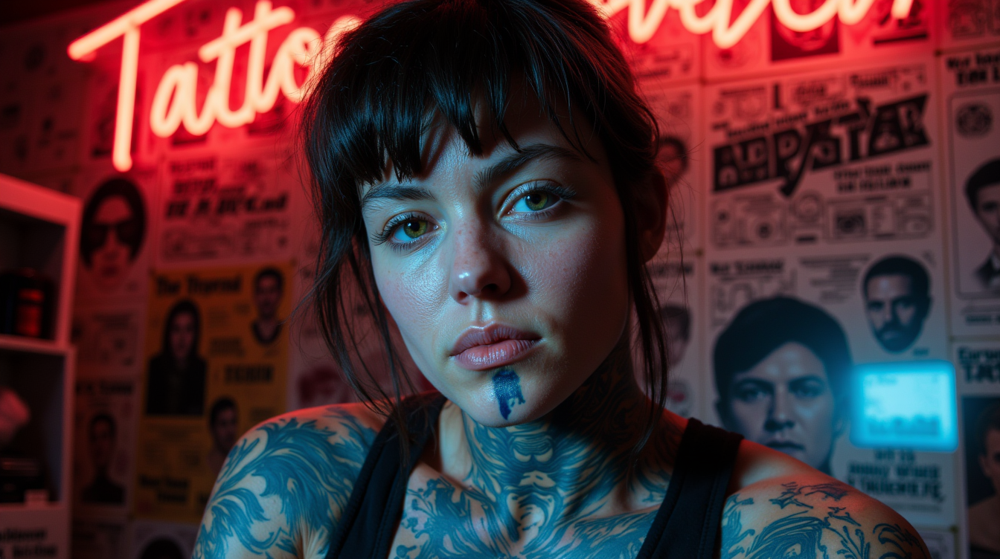

# AI Portrait Generator with ComfyUI


*A stunning portrait showcasing intricate tattoo details and mesmerizing blue eyes*

## Overview

This project uses ComfyUI to generate hyperrealistic portraits using a custom workflow with the FLUX model. The system consists of two main scripts that work together to create beautiful, AI-generated portraits:

1. `fetch_prompt.py` - Fetches and processes portrait prompts
2. `run-comfy.py` - Generates images using ComfyUI with enhanced prompts

## Features

- High-quality portrait generation using FLUX model
- Prompt enhancement using Ollama
- Custom workflow optimized for photorealistic results
- Batch processing capabilities
- Advanced noise seed management


*Creative "bug's-eye view" demonstrating the system's capability for unique perspectives*

## Prerequisites

- Python 3.8+
- ComfyUI installation
- Ollama with qwen2.5:14b model
- Required models:
  - FLUX model
  - FluxRaslismLora.safetensors
  - Eye_Detail_Flux_Lora.safetensors
  - skin texture style v5.safetensors

## Installation

1. Clone this repository:
```bash
git clone <repository-url>
cd ai-portrait-generator
```

2. Install dependencies:
```bash
pip install datasets requests
```

3. Ensure ComfyUI is properly set up with required models

## Usage

### Step 1: Generate Prompts

Run the prompt fetcher to create the initial prompt file:

```bash
python fetch_prompt.py
```

This will create `simple_prompts.json` with curated portrait prompts.

### Step 2: Generate Images

Start the image generation process:

```bash
python run-comfy.py
```


*Dynamic lighting demonstration with neon accents and moody atmosphere*

## How It Works

1. **Prompt Preparation**
   - Fetches carefully curated prompts from a dataset
   - Processes and saves them in a structured JSON format

2. **Image Generation**
   - Loads prompts from JSON
   - Enhances descriptions using Ollama
   - Processes through ComfyUI workflow
   - Generates high-quality portraits

3. **Workflow Details**
   - Uses FLUX model with custom LoRA adjustments
   - Implements advanced sampling techniques
   - Manages batch processing and seed variation

## Configuration

The workflow can be customized through `workflow.json`, which includes:

- Image dimensions (1344x756)
- Sampling steps (25)
- Guidance scale (5.5)
- Various LoRA weights and strengths

## Tips for Best Results

1. **Prompt Engineering**
   - Include specific details about facial features
   - Describe lighting conditions
   - Mention camera angle and perspective
   - Add emotional elements

2. **Model Settings**
   - Adjust guidance scale for different styles
   - Experiment with sampling steps
   - Fine-tune LoRA strengths

## Contributing

Contributions are welcome! Please feel free to submit pull requests or create issues for bugs and feature requests.

## License

This project is licensed under the MIT License - see the LICENSE file for details.

## Acknowledgments

- ComfyUI team
- FLUX model creators
- Dataset contributors